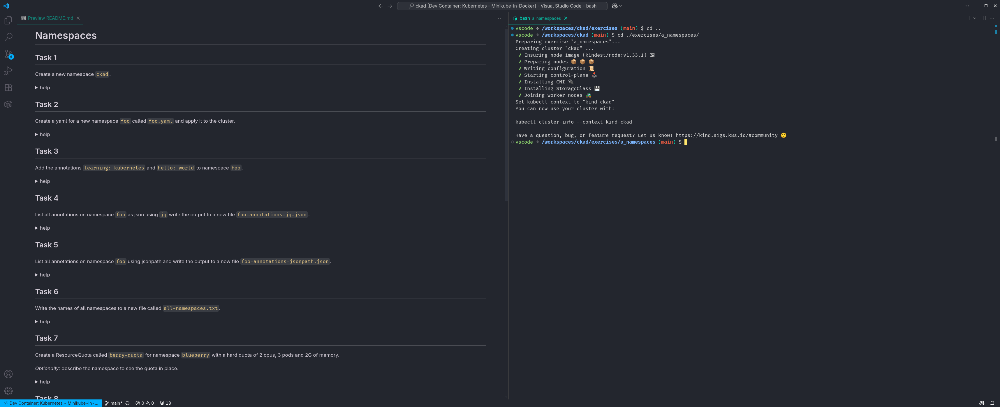

# CKAD Exam Preparation

The repository provides exercises to prepare yourself for the Certifite Kubernetes Application Developer (CKAD) Exam.

## Prerequisites

If you want to use the exercises in the "intended way" you need to install:

- a Container runtime like Docker
- Visual Studio Code

However it should be possible to just try to solve the exercises on any kubernetes clusters (but I didn't try it).

## Using the exercises

After installing a container runtime and VS Code, clone the repository and open the directory with VS Code.

VS Code will then start the environment for the exercises - if you're asked select to _open the project as DevContainer_.
This might take a while the first time, so be patient.

When VS Code is ready the workflow to use the exercises is always the same:

- Navigate to the exercise directory in a terminal window (i. e. `cd ./exercises/a_namespaces`)
  - This might take a moment because a new cluster is created for every exercise.
- Open up the exercise _README.md_ file as __preview__ (right click -> `Open Preview`)
- Use the `verify.sh` script in the exercise folder to check your success
  - This always checks all tasks but can be used whenever you want

__Note:__
Using drag and drop you can split your view between a terminal window and the exercise Readme.



## Under the hood

Everything you run for the exercises is executed locally, but does not affect your local environment.
This works with a combination of different tools:

- DevContainers to spin up a container that won't touch your local system and has everything needed to solve the exercises already installed.
- Docker in Docker (dind) to use Kubernetes inside that container.
- Autoenv to prepare and cleanup the exercises (start a cluster, remove files etc.)
- VS Code for ease of use as well as extensions for developing new exercises.

__Note:__
VS Code is not strictly necessary to use the DevContainer environment.
You can also use the DevContainer CLI, other IDEs or Editors that support DevContainers and so on.

## Known Issues

### Fedora Linux

- The container might not be able to access the docker-daemon (see: [github issue](https://github.com/devcontainers/features/issues/1235))
  - solution: enable the ip_tables kernel module: `sudo modprobe ip_tables`

## Exam helper snippets

These might be usefull to learn and use during the exam:

```shell
#!/bin/sh

# used to list files in the current directory
alias l='ls -lisa'

# used in kubectl create / run commands with $dry (i. e. kubectl create ... $DRYY > resource.yml
DRYY='--dry-run=client -o yaml'
DRYJ='--dry-run=client -o json'
export DRYY
export DRYJ

# set default namespace
sdn() { kubectl config set-context --current --namespace="$1" ; }

# reset default namespace
rdn() { kubectl config set-context --current --namespace=default ; }

# organize files per question
mkcd() { mkdir -p "$@" && cd "$@" || exit ; }

# create/destroy from yaml faster
alias kaf='kubectl apply -f'
alias kdf='kubectl delete -f'
```
